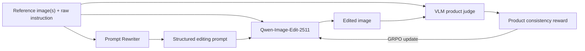

# ReCoEdit: Rewriter-Guided Consistency Alignment for Product Image Editing

<div align="center">

**ReCoEdit helps image editing models change the scene without changing the product.**

[Online Demo](https://huggingface.co/spaces/Matteoooo46/ReCoEdit-Demo) ·
[Project Blog](https://matteoooo46.github.io/ReCoEdit) ·
[RL Checkpoint](https://huggingface.co/Matteoooo46/ReCoEdit-RL) ·
[Rewriter Checkpoint](https://huggingface.co/Matteoooo46/ReCoEdit-rewriter)

</div>

<!--
TODO: Add a qualitative teaser to assets/recoedit_teaser.png, then uncomment:

<p align="center">
  
</p>
-->

##概述

Product image editing must satisfy two goals at the same time: follow the requested edit and preserve the identity of the reference product. In practice, colors shift, logos disappear, patterns change, and shapes deform when the model focuses too heavily on the new scene.

ReCoEdit addresses this problem with two learned components and an inference-time guidance method:

1. **Prompt Rewriter — Qwen3-VL-8B + LoRA.** Given one or more product reference images and a raw instruction, the rewriter produces a structured Chinese editing prompt for Qwen-Image-Edit.
2. **Consistency Alignment — Flow-GRPO + Product Reward.** Qwen-Image-Edit-2511 is optimized with online reinforcement learning. A Qwen3-VL-30B judge compares each edited image with its reference product and provides a normalized consistency reward.
3. **APG Inference.** Adaptive Projected Guidance is applied at inference time to reduce oversaturation and unstable CFG behavior.



## News

- **August 2026:** The [ReCoEdit online demo](https://huggingface.co/spaces/Matteoooo46/ReCoEdit-Demo) is now available on Hugging Face Spaces.

## Online Demo

Try the complete ReCoEdit workflow without setting up a local environment:

### [Launch the ReCoEdit Demo →](https://huggingface.co/spaces/Matteoooo46/ReCoEdit-Demo)

The demo provides an accessible entry point for product-image editing with the released ReCoEdit components.

## Key Results

The internal product-consistency reward improves substantially during RL training:

| Model stage | Product consistency reward ↑ | Change |
|---|---:|---:|
| SFT initialization | 0.022 | — |
| ReCoEdit RL, peak at epoch 25 | **0.480** | **+0.458 (21.8×)** |

- Base model: [Qwen-Image-Edit-2511](https://huggingface.co/Qwen/Qwen-Image-Edit-2511)
- RL framework: Flow-GRPO with LoRA rank 64
- Reward judge: [Qwen3-VL-30B-A3B-Instruct](https://huggingface.co/Qwen/Qwen3-VL-30B-A3B-Instruct)
- Training configuration: 8 GPUs, bf16, FSDP, activation checkpointing, and optimizer offload

See the [RL training report](flow_grpo/docs/RL_training_report.md) for the recorded training dynamics and configuration.

> [!NOTE]
> The value above is the reward used by the RL pipeline. Dataset statistics, independent benchmarks, ablations, and qualitative comparisons will be added after they are ready.

## Quick Start

### Option 1: Use the online demo

Open the [Hugging Face Space](https://huggingface.co/spaces/Matteoooo46/ReCoEdit-Demo), upload a product image, enter an editing instruction, and run the edit.

### Option 2: Run locally

#### 1. Clone and create the environment

```bash
git clone https://github.com/Matteoooo46/ReCoEdit.git
cd ReCoEdit

conda create -n recoedit python=3.10 -y
conda activate recoedit

pip install -r requirements.txt
pip install -e ./flow_grpo
```

The inference implementation also uses [DiffSynth-Studio](https://github.com/modelscope/DiffSynth-Studio):

```bash
git clone https://github.com/modelscope/DiffSynth-Studio.git third_party/DiffSynth-Studio
pip install -e third_party/DiffSynth-Studio
```

The APG inference scripts import the project APG helper described in [`APG_CFG_详解.md`](APG_CFG_详解.md). Make sure that helper is available on `PYTHONPATH` before running local inference.

#### 2. Run APG inference

The base model and ReCoEdit RL checkpoint are downloaded from Hugging Face on the first run and then reused from the local cache.

```bash
python inference/qwen_image_edit_2511_inference_apg.py \
    --input_image path/to/product.jpg \
    --prompt "把产品放到户外花园场景中" \
    --output outputs/result.png
```

#### 3. Run APG + Prompt Rewriter

```bash
python inference/qwen_image_edit_2511_inference_apg_rewriter.py \
    --input_image path/to/product.jpg \
    --prompt "把产品放到户外花园场景中" \
    --output outputs/result.png
```

Multiple reference images are supported:

```bash
python inference/qwen_image_edit_2511_inference_apg_rewriter.py \
    --input_image ref1.jpg ref2.jpg \
    --prompt "把产品放到户外花园场景中" \
    --output outputs/result.png
```

## Model Zoo

| Component | Base model | Released weights | Role |
|---|---|---|---|
| Image editor | [Qwen-Image-Edit-2511](https://huggingface.co/Qwen/Qwen-Image-Edit-2511) | [ReCoEdit-RL](https://huggingface.co/Matteoooo46/ReCoEdit-RL) | Product-consistent image editing |
| Prompt rewriter | [Qwen3-VL-8B-Instruct](https://huggingface.co/Qwen/Qwen3-VL-8B-Instruct) | [ReCoEdit-rewriter](https://huggingface.co/Matteoooo46/ReCoEdit-rewriter) | Structured editing-prompt generation |
| Reward judge | [Qwen3-VL-30B-A3B-Instruct](https://huggingface.co/Qwen/Qwen3-VL-30B-A3B-Instruct) | — | Product-consistency scoring during RL |

##培训

The complete training workflow contains three stages. You can use only the stages relevant to your experiment.

### 1. Prompt Rewriter SFT

Register your dataset in LLaMA-Factory, then replace the values marked `EDIT` in [`scripts/rewriter_sft_qwen3vl_8b.yaml`](scripts/rewriter_sft_qwen3vl_8b.yaml):

```bash
llamafactory-cli train scripts/rewriter_sft_qwen3vl_8b.yaml
```

### 2. Qwen-Image-Edit SFT

```bash
export DIFFSYNTH_DIR=/path/to/DiffSynth-Studio
export TRAIN_METADATA=/path/to/metadata.json
export OUTPUT_DIR=/path/to/output

# Full-parameter training
bash scripts/Qwen-Image-Edit-2511-full.sh

# Or LoRA training
bash scripts/Qwen-Image-Edit-2511.sh
```

### 3. GRPO Consistency Alignment

Start an OpenAI-compatible vLLM server for the reward judge and configure its endpoint:

```bash
cp .env.example .env
# Edit .env, then load it:
source .env
```

Before launching, update the dataset, model, SFT checkpoint, and output paths in `counting_qwenimage_edit_8gpu_product_consistency` inside [`flow_grpo/config/grpo.py`](flow_grpo/config/grpo.py).

```bash
cd flow_grpo
torchrun --standalone --nproc_per_node=8 scripts/train_qwenimage_edit.py \
    --config config/grpo.py:counting_qwenimage_edit_8gpu_product_consistency
```

## Evaluation

<!-- TODO: Add evaluation-set details. -->

The current repository reports the RL reward curve in the [training report](flow_grpo/docs/RL_training_report.md). A reproducible evaluation protocol will be added in a future update.

## Benchmarks

<!--
TODO: Add side-by-side Input / SFT / ReCoEdit comparisons here.
path: assets/benchmarks/
-->

## Acknowledgments

ReCoEdit builds on the following open-source projects and models:

- [Flow-GRPO](https://github.com/yifan123/flow_grpo) — reinforcement learning for flow-matching models
- [Qwen-Image](https://github.com/QwenLM/Qwen-Image) — base image-editing model family
- [Qwen3-VL](https://github.com/QwenLM/Qwen3-VL) — prompt rewriter and product-consistency judge
- [LLaMA-Factory](https://github.com/hiyouga/LLaMA-Factory) — prompt-rewriter SFT
- [DiffSynth-Studio](https://github.com/modelscope/DiffSynth-Studio) — image-model training and inference

## Citation

If ReCoEdit is useful for your work, please cite the repository:

```bibtex
@software{recoedit2025,
  title  = {ReCoEdit: Rewriter-Guided Consistency Alignment for Product Image Editing},
  author = {Matteoooo46},
  year   = {2026},
  url    = {https://github.com/Matteoooo46/ReCoEdit}
}
```

## License

This project is released under the [MIT License](LICENSE).
